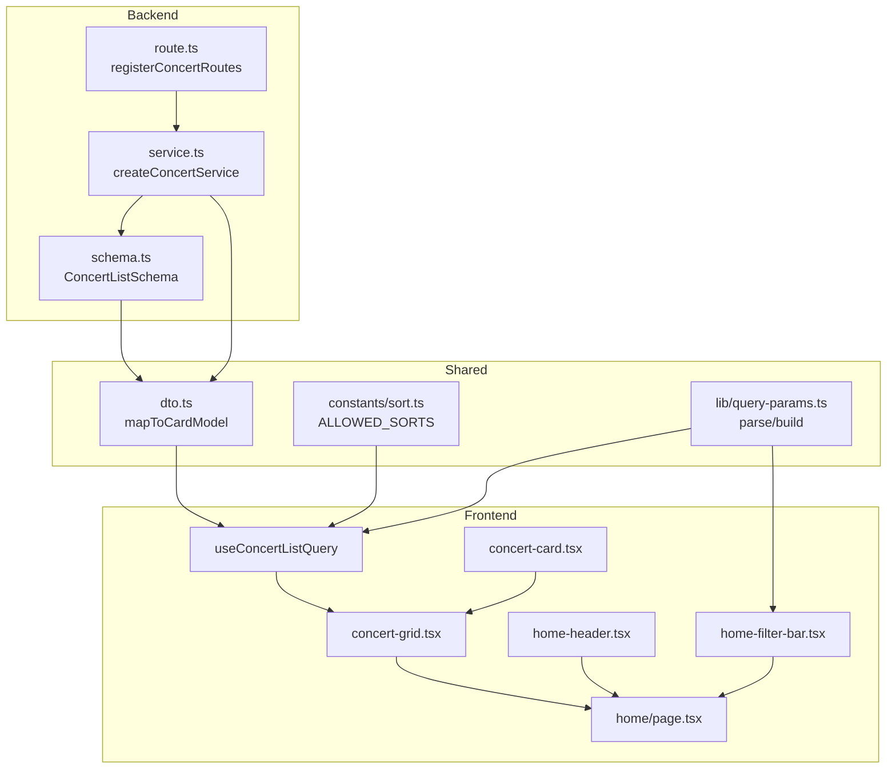

## 개요
- `src/features/concerts/backend/schema.ts`: 콘서트 목록 API의 요청·응답을 zod로 검증하고 공용 타입을 제공합니다.
- `src/features/concerts/backend/service.ts`: Supabase에서 `concerts` 및 `seat_classes`를 조회·집계하는 비즈니스 로직을 담당합니다.
- `src/features/concerts/backend/route.ts`: Hono 라우터에 `/concerts` 엔드포인트를 등록하고 표준 응답 포맷을 적용합니다.
- `src/features/concerts/lib/dto.ts`: 백엔드 스키마를 재노출하며 프런트에서 사용할 카드 모델 매퍼를 제공합니다.
- `src/features/concerts/constants/sort.ts`: 정렬/필터 허용 값과 라벨을 정의합니다.
- `src/features/concerts/lib/query-params.ts`: URLSearchParams 파싱/직렬화 유틸을 제공합니다.
- `src/features/concerts/hooks/useConcertListQuery.ts`: React Query 기반 데이터 훅으로 API 호출을 `apiClient`를 통해 수행합니다.
- `src/features/concerts/components/concert-card.tsx`: 콘서트 카드 UI를 구현하고 picsum.photos 플레이스홀더를 사용합니다.
- `src/features/concerts/components/concert-grid.tsx`: 목록/스켈레톤/빈 상태/에러 표시를 담당합니다.
- `src/app/(public)/home/_components/home-header.tsx`: 홈 페이지 상단 히어로 영역을 구성합니다.
- `src/app/(public)/home/_components/home-filter-bar.tsx`: 정렬/필터 UI를 제공하고 URL 동기화를 담당합니다.
- `src/app/(public)/home/page.tsx`: 홈 페이지 전체 조립 및 상태 관리 엔트리포인트입니다.

## Diagram

## Implementation Plan
### Backend
1. `schema.ts`
   - `ConcertListParamsSchema`로 `sort`, `isActive`, `page`, `pageSize`를 허용 값으로 제한합니다.
   - `SeatClassSummarySchema`, `ConcertSummarySchema`, `ConcertListResponseSchema`를 정의하고 타입을 export합니다.
   - Unit Test: 경계값(pageSize) 및 잘못된 sort 처리 등 validation 시나리오 검증 (`schema.test.ts`).
2. `service.ts`
   - `createConcertService(env: AppEnv)` 팩토리를 작성하고 `fetchConcertList` 함수에서 `ts-pattern`으로 정렬 분기를 처리합니다.
   - Supabase 쿼리에서 `seat_classes` 집계를 포함하고 오류 시 로거와 `failure()`를 사용합니다.
   - Unit Test: Supabase mock으로 정렬/필터/빈 결과 흐름 검증 (`service.test.ts`).
3. `route.ts`
   - `registerConcertRoutes(app)`에서 `app.get("/concerts")`를 등록하고 쿼리 파라미터를 `schema.parse`로 검증합니다.
   - 성공 시 `success()`/`respond()`를 사용하고 validation 실패는 400, 기타 오류는 500으로 매핑합니다.
   - Integration Test: Hono 테스트 클라이언트로 성공/실패 응답을 검증 (`tests/backend/concerts.route.test.ts`).
4. `dto.ts`
   - 백엔드 스키마 타입(`ConcertSummary`, `SeatClassSummary`)을 재노출합니다.
   - `mapConcertSummaryToCardModel`에서 `date-fns` `format`으로 날짜를 처리하고 잔여석 합계와 포스터 fallback을 제공합니다.
   - Unit Test: 날짜 포맷, fallback poster, 매진 플래그 검증 (`dto.test.ts`).

### Shared Utilities
5. `constants/sort.ts`
   - `ALLOWED_SORTS`, `DEFAULT_SORT`, 라벨 맵과 타입(`SortKey`)을 정의합니다.
6. `lib/query-params.ts`
   - `parseConcertListSearchParams(searchParams)`로 허용 값만 추출하고 기본값을 적용합니다.
   - `buildConcertListQuery(params)`로 URLSearchParams를 생성하며 undefined 값을 제거합니다.
   - Unit Test: round-trip 변환 및 invalid 값 필터링 검증 (`query-params.test.ts`).

### Frontend
7. `hooks/useConcertListQuery.ts`
   - `useQuery`를 구성하여 `apiClient.get('/concerts', { params })` 호출 후 응답을 `ConcertListResponseSchema`로 파싱합니다.
   - DTO 매퍼를 적용하고 `extractApiErrorMessage`로 에러 메시지를 처리합니다.
   - Unit Test: React Query `renderHook`으로 성공/에러 상태를 검증 (`useConcertListQuery.test.tsx`).
8. `components/concert-card.tsx`
   - 카드 UI를 구현하고 잔여석 0일 때 `예약 마감` 배지를 노출합니다.
   - QA Sheet: 접근성(포커스 가능, aria-label) 및 반응형 레이아웃 검사 항목 정의.
9. `components/concert-grid.tsx`
   - 로딩/성공/빈 상태/에러 상태별 UI를 분기하고 `useToast`로 에러 토스트를 트리거합니다.
   - QA Sheet: 스켈레톤 노출 조건, 빈 결과 메시지, 에러 재시도 버튼 확인 항목 정의.
10. `home-header.tsx`
    - 히어로 섹션과 CTA 버튼(예약 조회 이동)을 구성합니다.
    - QA Sheet: 모바일 레이아웃, 대비 비율, 키보드 포커스 스타일 확인.
11. `home-filter-bar.tsx`
    - 정렬 select와 활성 필터 토글을 제공하고 변경 시 `router.push`로 URL을 갱신합니다.
    - QA Sheet: 키보드 내비게이션, 포커스 이동, 상태 동기화 확인.
12. `home/page.tsx`
    - 클라이언트 컴포넌트로 `useSearchParams`를 통해 쿼리를 파싱하고 `parseConcertListSearchParams`를 사용합니다.
    - `useConcertListQuery`를 호출하여 데이터를 가져오고 `home-header`, `home-filter-bar`, `concert-grid`를 조합합니다.
    - QA Sheet: 초기 로딩 상태, 필터 변경 후 재요청, 링크 네비게이션(상세 페이지 이동) 확인 항목 정의.
    - UI 회귀 테스트: Playwright 시나리오로 정렬 변경과 빈 상태 노출을 확인 (`tests/e2e/home.spec.ts`).
