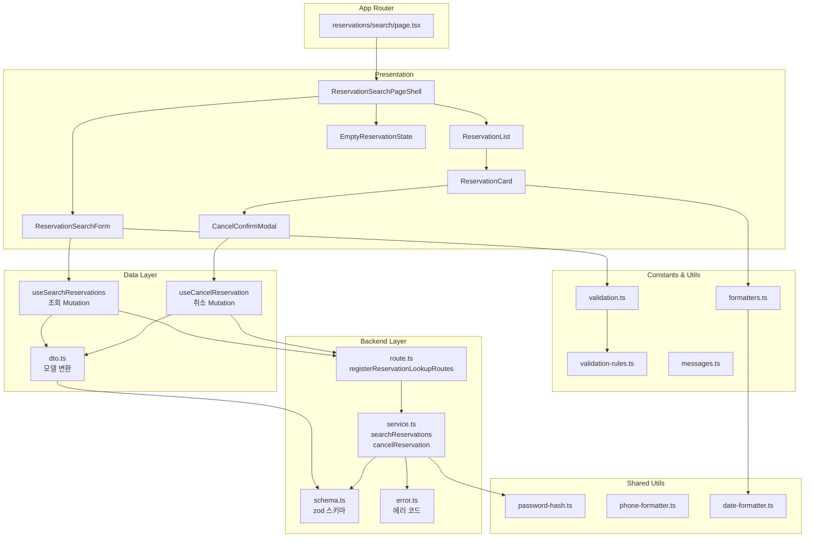

# 예약 조회 및 취소 페이지 모듈 설계

## 개요

### Backend Modules
- `src/features/reservation-lookup/backend/schema.ts`: 예약 조회 및 취소 요청·응답 zod 스키마 정의
- `src/features/reservation-lookup/backend/error.ts`: 예약 조회/취소 관련 에러 코드 상수
- `src/features/reservation-lookup/backend/service.ts`: Supabase 기반 예약 검색/취소 비즈니스 로직
- `src/features/reservation-lookup/backend/route.ts`: `/reservations/search`, `/reservations/:id/cancel` Hono 라우터

### Frontend Data Layer
- `src/features/reservation-lookup/lib/dto.ts`: Backend 스키마 재노출 및 클라이언트 모델 변환
- `src/features/reservation-lookup/hooks/useSearchReservations.ts`: 예약 조회 Mutation 훅
- `src/features/reservation-lookup/hooks/useCancelReservation.ts`: 예약 취소 Mutation 훅

### Frontend Presentation
- `src/features/reservation-lookup/components/ReservationSearchPageShell.tsx`: 페이지 전체 레이아웃 및 상태 관리
- `src/features/reservation-lookup/components/ReservationSearchForm.tsx`: 전화번호/비밀번호 입력 폼
- `src/features/reservation-lookup/components/ReservationList.tsx`: 조회된 예약 목록 컨테이너
- `src/features/reservation-lookup/components/ReservationCard.tsx`: 개별 예약 카드 UI
- `src/features/reservation-lookup/components/CancelConfirmModal.tsx`: 예약 취소 확인 모달
- `src/features/reservation-lookup/components/EmptyReservationState.tsx`: 빈 결과 상태 UI

### Frontend Constants & Utils
- `src/features/reservation-lookup/constants/validation-rules.ts`: 전화번호/비밀번호 검증 규칙
- `src/features/reservation-lookup/constants/messages.ts`: 안내 메시지, 에러 메시지 상수
- `src/features/reservation-lookup/lib/validation.ts`: zod 기반 폼 검증 스키마
- `src/features/reservation-lookup/lib/formatters.ts`: 예약 정보 포맷터 (날짜, 가격)

### App Router
- `src/app/reservations/search/page.tsx`: 예약 조회 페이지 엔트리포인트

### Shared Utilities (공통 모듈)
- `src/lib/utils/password-hash.ts`: 비밀번호 해싱 및 검증 (bcrypt)
- `src/lib/utils/phone-formatter.ts`: 전화번호 포맷 및 검증
- `src/lib/utils/date-formatter.ts`: 공통 날짜 포맷 유틸

## Diagram



## Implementation Plan

### 1. Backend Layer

#### 1.1 `schema.ts`
- **SearchReservationsRequestSchema**: 
  - `phoneNumber`: 숫자만, 10-11자리 검증
  - `password`: 숫자 4자리 검증
- **ReservationSeatSchema**: 예약된 좌석 정보
  - `seatLabel`: 좌석 표시 (예: VIP석 A열 5번)
  - `unitPrice`: 좌석 단가
- **ReservationDetailSchema**: 개별 예약 상세
  - `id`: uuid
  - `concertId`: uuid
  - `concertTitle`: string
  - `concertStartAt`: string (ISO date)
  - `venueName`: string
  - `reservationCode`: string
  - `status`: 'reserved' | 'canceled'
  - `totalPrice`: number
  - `reservedAt`: string (ISO date)
  - `canceledAt`: string | null
  - `seats`: ReservationSeat[]
- **SearchReservationsResponseSchema**:
  - `reservations`: ReservationDetail[]
- **CancelReservationParamsSchema**:
  - `reservationId`: uuid
- **CancelReservationResponseSchema**:
  - `reservationId`: uuid
  - `status`: 'canceled'
  - `canceledAt`: string

**Unit Test**:
- [ ] 전화번호 형식 검증 (10자리, 11자리, 잘못된 형식)
- [ ] 비밀번호 형식 검증 (4자리, 3자리, 문자 포함)
- [ ] 응답 스키마 파싱 성공/실패

#### 1.2 `error.ts`
```typescript
export const reservationLookupErrorCodes = {
  // 조회 관련
  authenticationFailed: 'AUTHENTICATION_FAILED',
  noReservationsFound: 'NO_RESERVATIONS_FOUND',
  searchFailed: 'RESERVATION_SEARCH_FAILED',
  
  // 취소 관련
  reservationNotFound: 'RESERVATION_NOT_FOUND',
  alreadyCanceled: 'ALREADY_CANCELED',
  cancelNotAllowed: 'CANCEL_NOT_ALLOWED',
  cancelFailed: 'RESERVATION_CANCEL_FAILED',
  
  // 검증 관련
  validationError: 'VALIDATION_ERROR',
} as const;

export type ReservationLookupServiceError = 
  (typeof reservationLookupErrorCodes)[keyof typeof reservationLookupErrorCodes];
```

#### 1.3 `service.ts`

**searchReservations(supabase, request)**:
1. 전화번호로 reservations 테이블 조회
2. 각 예약의 password_hash와 입력된 password를 bcrypt로 비교
3. 매칭되는 예약 필터링
4. 예약별로 reservation_seats, seats, seat_classes 조인
5. concert 정보 조회
6. 최신순(reserved_at desc) 정렬, reserved 상태 우선
7. DTO로 변환하여 반환
8. 인증 실패 시 `AUTHENTICATION_FAILED` 반환
9. 예약 없음 시 빈 배열 반환 (성공)

**cancelReservation(supabase, reservationId)**:
1. reservationId로 예약 조회
2. status='reserved' 확인 (이미 취소된 경우 idempotent 응답)
3. concert 조회하여 시작 시각 확인 (취소 가능 기간 검증)
4. 트랜잭션 시작:
   - reservations.status = 'canceled', canceled_at = now()
   - reservation_seats에서 연결된 seat_id 조회
   - seats.is_reserved = false 복구
   - reservation_seats.is_active = false 갱신
   - seat_classes.available_seats 복구 (등급별 카운트)
5. 커밋 후 취소 정보 반환
6. 실패 시 적절한 에러 코드 반환

**Unit Test**:
- [ ] 예약 조회 성공 시나리오 (비밀번호 일치)
- [ ] 예약 조회 실패 시나리오 (비밀번호 불일치)
- [ ] 예약 없음 시나리오 (전화번호 미등록)
- [ ] 예약 취소 성공 플로우
- [ ] 이미 취소된 예약 재취소 (idempotent)
- [ ] 취소 불가 시나리오 (공연 시작 임박)
- [ ] 좌석 재고 복구 검증

#### 1.4 `route.ts`
```typescript
export const registerReservationLookupRoutes = (app: Hono<AppEnv>) => {
  // POST /reservations/search
  app.post('/reservations/search', async (c) => {
    // body 검증
    // searchReservations 호출
    // respond 반환
  });
  
  // POST /reservations/:id/cancel
  app.post('/reservations/:id/cancel', async (c) => {
    // params 검증
    // cancelReservation 호출
    // respond 반환
  });
};
```
- `src/backend/hono/app.ts`에 `registerReservationLookupRoutes(app)` 등록

**Integration Test**:
- [ ] POST /reservations/search 성공 응답 (200)
- [ ] POST /reservations/search 인증 실패 (401/403)
- [ ] POST /reservations/search 검증 실패 (400)
- [ ] POST /reservations/:id/cancel 성공 응답 (200)
- [ ] POST /reservations/:id/cancel 이미 취소된 예약 (200, idempotent)
- [ ] POST /reservations/:id/cancel 취소 불가 (400/403)

### 2. Frontend Data Layer

#### 2.1 `dto.ts`
- Backend 스키마 재노출
  - `SearchReservationsRequest`
  - `ReservationDetail`
  - `SearchReservationsResponse`
  - `CancelReservationResponse`
- **mapReservationToCardModel**: 
  - 날짜 포맷 (`date-fns`)
  - 가격 포맷 (`Intl.NumberFormat`)
  - 좌석 요약 문자열 생성 (예: "VIP석 2매, R석 1매")
  - 취소 가능 여부 계산 (공연 시작 시각 기준)

**Unit Test**:
- [ ] 날짜 포맷 정확성
- [ ] 가격 포맷 (원화)
- [ ] 좌석 요약 문자열 생성
- [ ] 취소 가능 여부 로직

#### 2.2 `useSearchReservations.ts`
```typescript
export const useSearchReservations = () => {
  return useMutation({
    mutationFn: async (request: SearchReservationsRequest) => {
      const { data } = await apiClient.post('/api/reservations/search', request);
      return SearchReservationsResponseSchema.parse(data);
    },
    onError: (error) => {
      // 에러 토스트 표시
    },
  });
};
```

#### 2.3 `useCancelReservation.ts`
```typescript
export const useCancelReservation = () => {
  const queryClient = useQueryClient();
  
  return useMutation({
    mutationFn: async (reservationId: string) => {
      const { data } = await apiClient.post(`/api/reservations/${reservationId}/cancel`);
      return CancelReservationResponseSchema.parse(data);
    },
    onSuccess: () => {
      // 조회 결과 무효화 (재조회)
      // 성공 토스트 표시
    },
  });
};
```

### 3. Frontend Presentation

#### 3.1 `ReservationSearchPageShell.tsx`
```typescript
'use client';

export const ReservationSearchPageShell = () => {
  const [searchResults, setSearchResults] = useState<ReservationDetail[] | null>(null);
  const searchMutation = useSearchReservations();
  
  const handleSearch = (formData: SearchReservationsRequest) => {
    searchMutation.mutate(formData, {
      onSuccess: (response) => {
        setSearchResults(response.reservations);
      },
    });
  };
  
  return (
    <div className="container mx-auto px-4 py-8">
      <ReservationSearchForm 
        onSubmit={handleSearch}
        isLoading={searchMutation.isPending}
      />
      
      {searchMutation.isError && (
        <div className="mt-4 p-4 bg-red-50 text-red-800 rounded">
          {extractApiErrorMessage(searchMutation.error, '예약 조회에 실패했습니다.')}
        </div>
      )}
      
      {searchResults !== null && (
        searchResults.length > 0 ? (
          <ReservationList reservations={searchResults} />
        ) : (
          <EmptyReservationState />
        )
      )}
    </div>
  );
};
```

**QA Sheet**:
- [ ] 조회 전 초기 상태 렌더링 확인
- [ ] 로딩 중 스피너 표시
- [ ] 조회 성공 시 목록 표시
- [ ] 조회 실패 시 에러 메시지 표시
- [ ] 빈 결과 시 안내 메시지 표시

#### 3.2 `ReservationSearchForm.tsx`
- react-hook-form + zod 검증
- 전화번호 입력: 숫자만 허용, 자동 포맷팅
- 비밀번호 입력: type="password", 숫자 4자리
- 실시간 검증 및 에러 메시지 표시
- 조회하기 버튼 (disabled 조건: 검증 실패 또는 로딩 중)

**QA Sheet**:
- [ ] 전화번호 숫자만 입력 허용
- [ ] 비밀번호 마스킹 처리
- [ ] 폼 검증 에러 메시지 위치 및 내용
- [ ] 키보드 Enter로 제출 가능
- [ ] 포커스 이동 및 접근성 (label, aria)

#### 3.3 `ReservationList.tsx`
- 예약 목록을 받아 ReservationCard로 렌더링
- reserved 상태 우선, 최신순 정렬
- 과거 예약 (canceled) 섹션 분리 (선택사항)

**QA Sheet**:
- [ ] reserved 예약 우선 표시
- [ ] 최신순 정렬 확인
- [ ] 빈 목록 처리

#### 3.4 `ReservationCard.tsx`
- 예약 정보 표시:
  - 공연 제목, 일시, 장소
  - 예약 번호, 예약 일시
  - 좌석 요약 (등급별)
  - 총 금액
  - 상태 배지 (예약 중 / 취소됨)
- 예약 취소 버튼 (reserved 상태만, 취소 가능 기간 확인)
- 버튼 클릭 시 CancelConfirmModal 열기

**QA Sheet**:
- [ ] 예약 정보 정확성
- [ ] 상태 배지 색상 구분 (reserved: 초록, canceled: 회색)
- [ ] 취소 버튼 표시 조건 (reserved + 취소 가능 기간)
- [ ] 취소 버튼 비활성 시 툴팁/안내
- [ ] 카드 레이아웃 반응형

#### 3.5 `CancelConfirmModal.tsx`
- shadcn Dialog 컴포넌트 활용
- 예약 정보 요약 표시
- 확인/취소 버튼
- useCancelReservation 호출
- 성공 시 모달 닫기 + 목록 재조회 트리거

**QA Sheet**:
- [ ] 모달 열림/닫힘 애니메이션
- [ ] 취소 중 로딩 상태
- [ ] 성공 시 모달 닫힘 + 목록 갱신
- [ ] 실패 시 에러 메시지 표시
- [ ] ESC 키로 모달 닫기
- [ ] 배경 클릭으로 모달 닫기

#### 3.6 `EmptyReservationState.tsx`
- 빈 상태 일러스트 또는 아이콘
- "예약 내역이 없습니다" 메시지
- 홈으로 돌아가기 버튼

**QA Sheet**:
- [ ] 빈 상태 메시지 명확성
- [ ] 링크 버튼 동작 확인

### 4. Constants & Utils

#### 4.1 `validation-rules.ts`
```typescript
export const PHONE_REGEX = /^[0-9]{10,11}$/;
export const PASSWORD_REGEX = /^[0-9]{4}$/;

export const VALIDATION_MESSAGES = {
  phoneRequired: '전화번호를 입력해주세요',
  phoneInvalid: '10-11자리 숫자를 입력해주세요',
  passwordRequired: '비밀번호를 입력해주세요',
  passwordInvalid: '숫자 4자리를 입력해주세요',
};
```

#### 4.2 `messages.ts`
```typescript
export const MESSAGES = {
  emptyReservations: '예약 내역이 없습니다.',
  searchFailed: '예약 조회에 실패했습니다. 다시 시도해주세요.',
  authFailed: '전화번호 또는 비밀번호가 일치하지 않습니다.',
  cancelSuccess: '예약이 취소되었습니다.',
  cancelFailed: '예약 취소에 실패했습니다.',
  cancelNotAllowed: '공연 시작 시각이 지나 취소할 수 없습니다.',
  alreadyCanceled: '이미 취소된 예약입니다.',
};
```

#### 4.3 `validation.ts`
```typescript
import { z } from 'zod';
import { PHONE_REGEX, PASSWORD_REGEX, VALIDATION_MESSAGES } from '../constants/validation-rules';

export const SearchFormSchema = z.object({
  phoneNumber: z.string()
    .min(1, VALIDATION_MESSAGES.phoneRequired)
    .regex(PHONE_REGEX, VALIDATION_MESSAGES.phoneInvalid),
  password: z.string()
    .min(1, VALIDATION_MESSAGES.passwordRequired)
    .regex(PASSWORD_REGEX, VALIDATION_MESSAGES.passwordInvalid),
});

export type SearchFormData = z.infer<typeof SearchFormSchema>;
```

**Unit Test**:
- [ ] 전화번호 검증 (유효/무효)
- [ ] 비밀번호 검증 (유효/무효)

#### 4.4 `formatters.ts`
```typescript
import { format } from 'date-fns';
import { ko } from 'date-fns/locale';

export const formatConcertDateTime = (isoDate: string): string => {
  return format(new Date(isoDate), 'yyyy년 M월 d일 (E) HH:mm', { locale: ko });
};

export const formatReservationDate = (isoDate: string): string => {
  return format(new Date(isoDate), 'yyyy.MM.dd HH:mm');
};

export const formatPrice = (price: number): string => {
  return new Intl.NumberFormat('ko-KR', {
    style: 'currency',
    currency: 'KRW',
  }).format(price);
};

export const formatSeatsSummary = (seats: ReservationSeat[]): string => {
  // 등급별 그룹핑
  const grouped = seats.reduce((acc, seat) => {
    const className = seat.seatLabel.split(' ')[0]; // 예: "VIP석" 추출
    acc[className] = (acc[className] || 0) + 1;
    return acc;
  }, {} as Record<string, number>);
  
  return Object.entries(grouped)
    .map(([className, count]) => `${className} ${count}매`)
    .join(', ');
};
```

**Unit Test**:
- [ ] 날짜 포맷 출력 확인
- [ ] 가격 포맷 (원화 기호, 천 단위 구분)
- [ ] 좌석 요약 생성 (등급별 카운트)

### 5. Shared Utilities

#### 5.1 `lib/utils/password-hash.ts` (공통)
```typescript
import bcrypt from 'bcryptjs';

export const hashPassword = async (password: string): Promise<string> => {
  const salt = await bcrypt.genSalt(10);
  return bcrypt.hash(password, salt);
};

export const verifyPassword = async (password: string, hash: string): Promise<boolean> => {
  return bcrypt.compare(password, hash);
};
```

**참고**: page003(좌석 선택)에서도 사용하므로 공통 모듈로 관리

#### 5.2 `lib/utils/phone-formatter.ts` (공통)
```typescript
export const formatPhoneNumber = (phoneNumber: string): string => {
  // 010-1234-5678 형식으로 변환
  const cleaned = phoneNumber.replace(/\D/g, '');
  
  if (cleaned.length === 11) {
    return `${cleaned.slice(0, 3)}-${cleaned.slice(3, 7)}-${cleaned.slice(7)}`;
  }
  
  if (cleaned.length === 10) {
    return `${cleaned.slice(0, 3)}-${cleaned.slice(3, 6)}-${cleaned.slice(6)}`;
  }
  
  return phoneNumber;
};

export const cleanPhoneNumber = (phoneNumber: string): string => {
  return phoneNumber.replace(/\D/g, '');
};
```

**Unit Test**:
- [ ] 11자리 포맷팅
- [ ] 10자리 포맷팅
- [ ] 숫자 클리닝

#### 5.3 `lib/utils/date-formatter.ts` (공통)
- 날짜 관련 유틸은 formatters.ts에서 재사용하거나 공통화 검토

### 6. App Router

#### 6.1 `reservations/search/page.tsx`
```typescript
'use client';

export default function ReservationSearchPage() {
  return <ReservationSearchPageShell />;
}
```

**QA Sheet**:
- [ ] 페이지 초기 로딩 확인
- [ ] URL 직접 접근 가능
- [ ] 뒤로가기 시 상태 유지 여부

### 7. Testing Strategy

#### Backend Unit Tests
- `service.test.ts`:
  - [ ] 예약 조회 성공 (비밀번호 일치)
  - [ ] 예약 조회 실패 (비밀번호 불일치)
  - [ ] 예약 없음 (전화번호 미등록)
  - [ ] 예약 취소 성공 플로우
  - [ ] 이미 취소된 예약 재취소 (idempotent)
  - [ ] 취소 불가 시나리오 (공연 시작 후)
  - [ ] 좌석 재고 복구 검증

#### Frontend Unit Tests
- `validation.test.ts`:
  - [ ] 폼 스키마 검증
- `formatters.test.ts`:
  - [ ] 날짜/가격/좌석 요약 포맷 정확성
- `dto.test.ts`:
  - [ ] 카드 모델 변환 로직

#### Integration Tests
- `tests/features/reservation-lookup/backend/route.test.ts`:
  - [ ] POST /reservations/search 성공/실패
  - [ ] POST /reservations/:id/cancel 성공/실패

#### E2E Tests (Playwright)
- `tests/e2e/reservation-lookup.spec.ts`:
  - [ ] 예약 조회 전체 플로우
  - [ ] 예약 취소 전체 플로우
  - [ ] 에러 처리 시나리오

### 8. 통합 고려사항

1. **bcryptjs 패키지 설치**: 
   ```bash
   npm install bcryptjs
   npm install -D @types/bcryptjs
   ```

2. **shadcn-ui Dialog 컴포넌트 설치** (미설치 시):
   ```bash
   npx shadcn@latest add dialog
   ```

3. **API 엔드포인트 경로**:
   - 조회: `POST /api/reservations/search`
   - 취소: `POST /api/reservations/:id/cancel`

4. **에러 처리**:
   - 인증 실패: 401/403 응답, 사용자 친화적 메시지
   - 취소 불가: 400 응답, 사유 명시
   - 네트워크 오류: 재시도 안내

5. **보안**:
   - 비밀번호는 절대 로그에 기록 금지
   - API 응답에 password_hash 노출 금지
   - Rate limiting 고려 (추후)

6. **접근성**:
   - 폼 필드 label 명시
   - 에러 메시지 aria-live
   - 모달 포커스 트랩

7. **UX**:
   - 조회 성공 시 부드러운 스크롤 (목록으로)
   - 취소 성공 시 목록 자동 갱신
   - 로딩 상태 명확히 표시

### 9. 후속 작업 및 개선사항

1. **성능 최적화**:
   - 조회 결과 캐싱 (React Query)
   - 페이지네이션 (예약 수가 많을 경우)

2. **기능 개선**:
   - 예약 상세 보기 (확장 가능한 아코디언)
   - 예약증 다운로드 (PDF)
   - 이메일 재전송 (선택사항)

3. **모니터링**:
   - 조회 실패율 추적
   - 취소율 분석
   - 인증 실패 시도 모니터링

4. **보안 강화**:
   - Rate limiting (brute-force 방지)
   - 조회 시도 제한 (IP 기반)
   - 비밀번호 복잡도 정책 (추후)

5. **다국어 지원**:
   - i18n 준비 (메시지 상수화)

