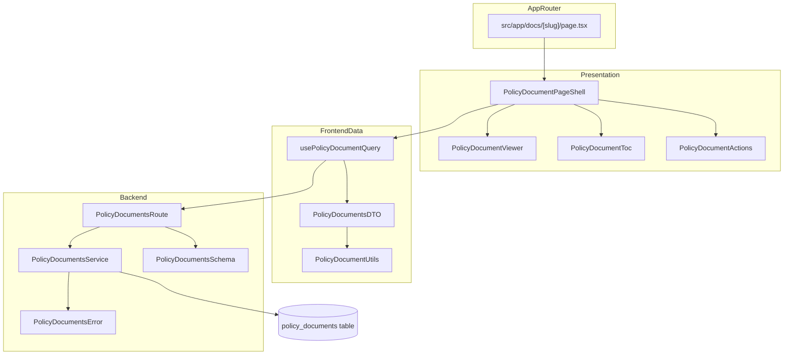

# 정적 문서 페이지 모듈 설계

## 개요
- `policy_documents` (`supabase/migrations/0003_create_policy_documents_table.sql`): 정책 문서를 버전/시행일과 함께 저장하는 테이블과 트리거를 정의.
- `PolicyDocumentsSchema` (`src/features/policy-docs/backend/schema.ts`): 슬러그 파라미터 및 문서 응답을 검증하는 zod 스키마 제공.
- `PolicyDocumentsError` (`src/features/policy-docs/backend/error.ts`): 문서 미존재, 비활성, 알 수 없음 에러 코드와 메시지 매핑 정의.
- `PolicyDocumentsService` (`src/features/policy-docs/backend/service.ts`): Supabase에서 최신 활성 문서를 조회하고 도메인 모델을 반환하는 비즈니스 로직.
- `PolicyDocumentsRoute` (`src/features/policy-docs/backend/route.ts`): `/docs/:slug` GET 엔드포인트 등록 및 캐시 헤더 응답 처리.
- `PolicyDocumentsDTO` (`src/features/policy-docs/lib/dto.ts`): 백엔드 스키마 재노출, React Query 키, 날짜 포맷 유틸 정의.
- `PolicyDocumentUtils` (`src/features/policy-docs/lib/utils.ts`): Markdown heading 인덱스, 외부 링크 보안 속성, HTML 렌더링 헬퍼 집합.
- `usePolicyDocumentQuery` (`src/features/policy-docs/hooks/usePolicyDocumentQuery.ts`): `@tanstack/react-query` 기반 정책 문서 패칭 훅, `@/lib/remote/api-client` 경유.
- `PolicyDocumentPageShell` (`src/features/policy-docs/components/PolicyDocumentPageShell.tsx`): 로딩/에러 상태와 레이아웃을 관리하는 클라이언트 컴포넌트.
- `PolicyDocumentViewer` (`src/features/policy-docs/components/PolicyDocumentViewer.tsx`): 정적 문서 본문 렌더링 및 접근성/typography 적용.
- `PolicyDocumentToc` (`src/features/policy-docs/components/PolicyDocumentToc.tsx`): heading 기반 목차 및 스크롤 포커스 보조 컴포넌트.
- `PolicyDocumentActions` (`src/features/policy-docs/components/PolicyDocumentActions.tsx`): 버전, 시행일, 재시도/다운로드 액션 영역.
- `DocsSlugPage` (`src/app/docs/[slug]/page.tsx`): Promise 기반 params를 사용하는 클라이언트 페이지 엔트리.
- `Footer` (`src/components/common/Footer.tsx`): 정책 문서 링크를 포함한 공통 Footer 컴포넌트.
- `FooterConstants` (`src/constants/footer.ts`): Footer에 표시될 정책 문서 링크 및 기타 상수 정의.
- `tests/policy-docs/service.spec.ts`: 서비스 레이어 단위 테스트 스위트.

## Diagram

## Implementation Plan

### Backend (Hono + Supabase)
1. `supabase/migrations/0003_create_policy_documents_table.sql`
   - `policy_documents` 테이블 생성: `id uuid PK`, `slug text unique not null`, `title text not null`, `content_markdown text not null`, `version text not null`, `effective_from date`, `is_active boolean default true`, `created_at`, `updated_at`.
   - `set_updated_at` 트리거 적용, RLS 비활성화, `slug` 인덱스 생성.
   - `terms-of-service`, `privacy-policy` 기본 레코드를 `insert ... on conflict (slug) do update` 패턴으로 시드.
2. `src/features/policy-docs/backend/schema.ts`
   - `PolicyDocumentParamsSchema` (`slug`는 `/^[a-z0-9-]+$/`)와 `PolicyDocumentResponseSchema` 정의.
   - `PolicyDocumentPayload` 타입 추론 export.
3. `src/features/policy-docs/backend/error.ts`
   - `policyDocumentErrorCodes` (`NOT_FOUND`, `INACTIVE`, `UNKNOWN`) 상수화.
   - `PolicyDocumentServiceError` 타입과 사용자 메시지 매핑 작성.
4. `src/features/policy-docs/backend/service.ts`
   - `getPolicyDocumentBySlug` 함수에서 Supabase `from('policy_documents')` 조회, `is_active = true` 조건과 최신 `effective_from` 우선 정렬.
   - 결과가 없으면 `failure(404, NOT_FOUND, ...)`, 비활성 문서는 `failure(410, INACTIVE, ...)` 반환.
   - 성공 시 `success`로 `PolicyDocumentPayload` 반환, `etagSignature` 등 캐시 힌트 포함.
5. `tests/policy-docs/service.spec.ts`
   - Supabase 클라이언트 mocking으로 정상 조회, 미존재, 비활성 시나리오 단위 테스트 작성.
6. `src/features/policy-docs/backend/route.ts`
   - `registerPolicyDocumentsRoutes(app)` 구현, 파라미터 safeParse 실패 시 400 응답.
   - 서비스 호출 후 `respond` 사용, 성공 시 `Cache-Control: public, max-age=60` 및 `ETag` 헤더 설정.
   - `createHonoApp`에 라우터 등록 (`registerExampleRoutes` 이후 추가).

### Frontend Data Layer
1. `src/features/policy-docs/lib/dto.ts`
   - 백엔드 스키마 재노출, `PolicyDocumentDto` 타입, `policyDocumentKeys.detail(slug)` React Query 키 작성.
   - `formatEffectiveDate` 함수에서 `date-fns` 사용해 YYYY.MM.DD 형식 출력.
2. `src/features/policy-docs/lib/utils.ts`
   - `buildHeadingIndex(markdown)`로 heading level, anchor id, label 리스트 구성.
   - `enrichExternalLinks(html)`에서 외부 링크 `rel="noopener noreferrer"`, `target="_blank"` 부여.
   - Markdown → HTML 렌더링 전략 조사(추가 라이브러리 필요 시 별도 안내), 우선 문자열 기반 파서 인터페이스 정의.
3. `src/features/policy-docs/hooks/usePolicyDocumentQuery.ts`
   - `useQuery(policyDocumentKeys.detail(slug), () => apiClient.get(...))` 구조.
   - 성공 시 DTO 변환, 에러는 `extractApiErrorMessage`로 메시지 가공.
   - `staleTime` 60초, `retry` 1회, `refetchOnWindowFocus` false 설정.

### Frontend Presentation & QA
1. `src/features/policy-docs/components/PolicyDocumentPageShell.tsx`
   - "use client" 선언, 슬러그 prop 수신 후 `usePolicyDocumentQuery` 호출.
   - 로딩 스피너, 오류 상태(재시도 버튼 포함), 성공 시 `PolicyDocumentViewer`/`PolicyDocumentToc`/`PolicyDocumentActions` 배치.
   - QA 시나리오: 로딩 스켈레톤 표시, 에러 발생 시 재시도 동작, 콘텐츠 렌더링 확인.
2. `src/features/policy-docs/components/PolicyDocumentViewer.tsx`
   - Markdown HTML 변환 결과를 안전하게 렌더링(`dangerouslySetInnerHTML` 시 sanitizer 고려).
   - heading에 `id` 부여, 외부 링크 보안 속성 확인.
   - QA 체크리스트: 접근성(heading 계층, 링크 focus), 긴 문서 스크롤 성능.
3. `src/features/policy-docs/components/PolicyDocumentToc.tsx`
   - `buildHeadingIndex` 결과를 인자로 받아 anchor 링크 목록 생성.
   - 현재 스크롤 위치에 따라 활성 항목 스타일링 (옵션).
   - QA: 목차 클릭 시 해당 heading으로 스크롤 이동, 키보드 접근성 점검.
4. `src/features/policy-docs/components/PolicyDocumentActions.tsx`
   - 문서 버전, 시행일, 마지막 업데이트 시간 표시.
   - 이후 PDF 다운로드/프린트 버튼 확장 가능하도록 props 설계.
   - QA: 날짜 포맷과 다국어 처리, 버튼 disable 상태 확인.
5. `src/app/docs/[slug]/page.tsx`
   - 클라이언트 컴포넌트, `export default async function Page({ params }: Promise<{ slug: string }>)` 패턴 준수.
   - 슬러그를 `PolicyDocumentPageShell`에 전달, 404 대비 fallback 안내 준비.
   - QA: 잘못된 슬러그 접근 시 404 처리, 브라우저 내비게이션 검사.

### Footer 통합
1. `src/constants/footer.ts`
   - 정책 문서 링크 목록 (`POLICY_LINKS`)과 기타 Footer 상수 정의.
   - 각 링크는 `label`, `href`, `slug` 속성 포함.
2. `src/components/common/Footer.tsx`
   - "use client" 클라이언트 컴포넌트로 구현.
   - `POLICY_LINKS` 사용하여 정책 문서 링크 동적 렌더링.
   - 회사 정보, 고객센터 등 추가 섹션 포함 가능하도록 확장 가능한 구조.
3. `src/app/layout.tsx` 또는 `src/app/(public)/layout.tsx`
   - Footer 컴포넌트를 children 하단에 배치하여 모든 페이지에서 표시.

### 추가 고려사항
- 캐시: Cloudflare/Next.js Edge 캐시 도입 시 `etagSignature`를 활용한 조건부 요청 고려.
- 보안: Markdown 렌더링 시 XSS 방지를 위한 sanitizer 도입 필요 여부 평가.
- 접근성: heading 구조, skip link, high-contrast 모드, 키보드 내비게이션 QA 포함.
- 성능: 문서가 장문일 경우 lazy loading 목차/anchor 업데이트 최적화 검토.
- Footer: 모든 페이지에서 일관되게 표시, 하드코딩 없이 상수 파일 사용.
