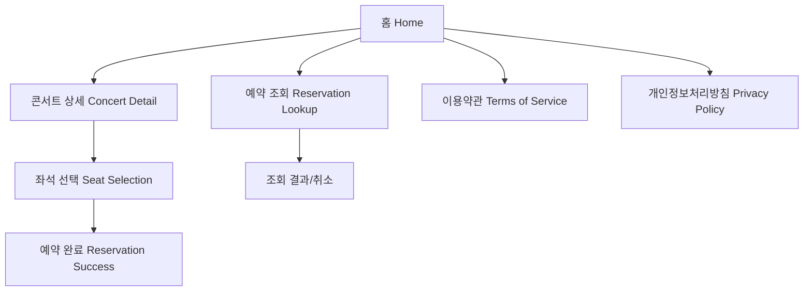
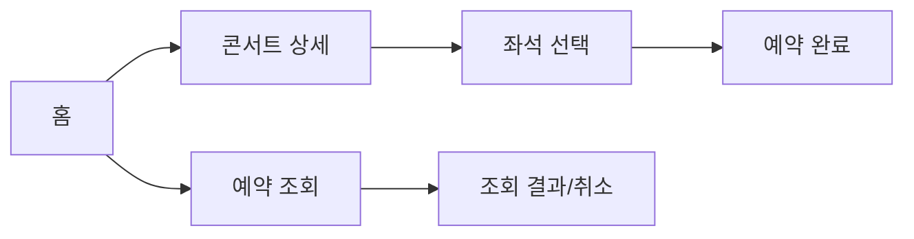

# 콘서트 예약 웹사이트 PRD (Supabase 기반, 좌석 선택 포함)

## 1. 제품 개요

### 목적

회원가입 없이 콘서트 목록을 확인하고,
공연 상세 페이지에서 **등급별 좌석 정보와 가격을 확인**,
**좌석 선택 → 예약자 정보 입력 → 예약 완료** 까지
단계별로 간결하고 직관적인 예약이 가능한 웹 애플리케이션을 구축한다.

### 핵심 목표

*   **로그인 없이 예약** 가능한 UX 설계
*   **좌석 등급별 재고 관리 및 가격 표시**
*   **Supabase** 기반의 실시간 데이터 저장 및 조회
*   **비밀번호 기반 예약조회 (핸드폰번호 + 4자리 비밀번호)**
*   **모바일 중심 반응형 인터페이스**

---

## 2. Stakeholders

| 구분 | 역할 | 주요 목적 |
| :--- | :--- | :--- |
| **End User (일반 사용자)** | 콘서트 정보 열람, 좌석 선택, 예약 및 조회 | 간편한 입력으로 공연 좌석 예약 |
| **System Admin (관리자)** | 공연 정보 초기 등록 및 좌석 데이터 세팅 (별도 CMS에서 수행) | 콘서트 등록 및 수정은 본 앱에서 제외 |
| **Developer / Designer** | UX/UI 및 Supabase 연동 구현 | 좌석 잔여량 및 예약 프로세스의 완결성 확보 |

---

## 3. 포함 페이지

| 페이지명 | 주요 기능 |
| :--- | :--- |
| **홈 (Home)** | 콘서트 목록 표시, 상세 페이지 이동 |
| **콘서트 상세 (Concert Detail)** | 공연정보, 설명, 등급별 잔여좌석, “예약하기” 버튼 |
| **좌석 선택 (Seat Selection)** | 좌석도 표시, 좌석 선택, 금액 계산, 예약자 정보 입력 |
| **예약 완료 (Reservation Success)** | 예약완료 안내 및 예약 요약 정보 표시 |
| **예약 조회 (Reservation Lookup)** | 비밀번호 기반 예약조회 및 **예약 취소** 기능 |
| **이용약관 / 개인정보처리방침 (Static)** | 법적 고지 페이지 |

---

## 4. 사용자 여정 (User Journey)

### Target User Segment

*   비회원으로 공연을 빠르게 예약하려는 일반 사용자
*   단순하고 직관적인 흐름을 선호하는 사용자

---

### **콘서트 예약 여정**

| 단계 | 페이지 | 사용자 행동 | 시스템 반응 |
| :--- | :--- | :--- | :--- |
| 1 | **홈** | 콘서트 목록에서 공연 선택 | 상세 페이지로 이동 |
| 2 | **콘서트 상세** | 공연 일정·장소 및 등급별 좌석 상황 확인 | 잔여석·가격 표시 |
| 3 | **콘서트 상세** | “예약하기” 버튼 클릭 | 좌석 선택 페이지로 이동 |
| 4 | **좌석 선택** | 등급별 좌석 중 원하는 좌석 클릭 | 선택된 좌석이 진한 색으로 활성화됨 |
| 5 | **좌석 선택** | 선택한 좌석 수 및 총 결제 금액 확인 | 실시간 합계 계산 표시 |
| 6 | **좌석 선택** | 핸드폰 번호 및 4자리 비밀번호 입력 후 “예약하기” 클릭 | Supabase에 예약 정보 저장, 잔여석 차감 |
| 7 | **예약 완료** | 예약 성공 메시지 및 예약번호 표시 | 공연명, 날짜, 좌석 등급/열/행/좌석수/총금액 표시 |

---

### **예약 조회 및 취소 여정**

| 단계 | 페이지 | 사용자 행동 | 시스템 반응 |
| :--- | :--- | :--- | :--- |
| 1 | **예약 조회** | 핸드폰 번호 + 비밀번호 입력 | Supabase에서 해당 예약 검색 |
| 2 | **예약 조회 결과** | 예약 정보 확인 | 예약번호, 공연명, 일정, 좌석정보 표시 |
| 3 | **예약 조회 결과** | **“예약 취소” 버튼 클릭** | **취소 확인 팝업 표시** |
| 4 | **예약 조회 결과** | **취소 확인** | **Supabase에서 예약 상태를 '취소'로 변경하고, 좌석 재고(잔여석)를 즉시 복구** |
| 5 | **예약 조회 결과** | **취소 완료 메시지 확인** | **취소 완료 안내 표시** |

---

## 5. 정보 구조 (IA)

---

## 6. 페이지별 구성요소 상세

### Home

*   콘서트 카드 리스트
    *   포스터, 제목, 날짜, 장소
    *   “상세 보기” 버튼

---

### Concert Detail

*   **공연정보**
    *   공연명, 일시, 장소
*   **공연 상세설명**
    *   프로그램 개요 및 출연자 정보
*   **등급별 잔여좌석 요약 테이블**

| 등급 | 가격 | 총좌석수 | 잔여석수 |
| :--- | :--- | :--- | :--- |
| VIP석 | 150,000원 | 50 | 12 |
| R석 | 120,000원 | 80 | 32 |
| S석 | 90,000원 | 120 | 58 |
| A석 | 60,000원 | 150 | 91 |

*   “예약하기” 버튼
    → 클릭 시 **좌석 선택 페이지로 이동**

---

### Seat Selection

*   **등급별 잔여좌석 테이블** (상단 고정)
*   **좌석배치도 (좌석 선택 UI)**
    *   무대(STAGE) 위치 표시
    *   각 등급별 색상 구분
    *   빈 좌석(회색) / 선택한 좌석(진한색) / 매진(회색 불투명)
*   **선택 정보 표시 영역**
    *   선택한 좌석 등급/번호 (예: VIP 2열 4번)
    *   선택 좌석 수
    *   총 결제 금액 (= 단가 × 수량)
*   **입력 필드**
    *   핸드폰 번호
    *   비밀번호 (숫자 4자리, 마스킹)
*   “예약하기” 버튼 클릭 시 → 예약 정보 Supabase 저장 후 → 예약 완료 페이지 이동

---

### Reservation Success

*   “예약이 완료되었습니다!” 메시지
*   예약번호 표시 (복사 버튼 포함)
*   공연정보 요약
    *   공연명, 날짜, 시간
    *   좌석 등급 / 열 / 행 / 좌석 수
    *   총 결제 금액

---

### Reservation Lookup

*   입력 필드
    *   핸드폰 번호
    *   비밀번호 (4자리 숫자)
*   “조회하기” 버튼 → 예약 내역 표시
*   결과 항목
    *   공연명 / 일시 / 좌석 등급 / 예약번호 / 금액 / 예약일자
*   **추가 기능**
    *   **예약 취소 버튼:** 클릭 시 확인 팝업을 통해 **예약 취소 트랜잭션을 실행**하고 상태를 업데이트함.

---

## 7. Supabase 데이터 구조 (요약)

| 테이블명 | 주요 컬럼 | 설명 |
| :--- | :--- | :--- |
| **concerts** | `id`, `title`, `date`, `venue`, `poster_url`, `description` | 공연 기본정보 |
| **seat_classes** | `id`, `concert_id`, `grade`, `price`, `total_seats`, `available_seats` | 등급별 좌석정보 |
| **seats** | `id`, `concert_id`, `grade`, `row`, `col`, `is_reserved` | 실제 좌석 단위 데이터 |
| **reservations** | `id`, `concert_id`, `phone`, `password_hash`, `seats` (JSON), `total_price`, `status` (`reserved` / `canceled`), `created_at` | 예약정보 저장 및 상태 관리 |

---

## 8. 비기능 요구사항

| 항목 | 설명 |
| :--- | :--- |
| **백엔드** | Supabase (PostgreSQL + JS SDK) |
| **보안** | 4자리 비밀번호 해시 저장 (bcrypt) |
| **데이터 검증** | 중복 좌석 예약 방지 트랜잭션 처리 |
| **UX/UI** | 모바일 퍼스트, 좌석 시각화 (Tailwind Grid) |
| **배포** | Vercel 자동 배포 |
| **성능 목표** | TTFB < 200ms, Lighthouse 85점 이상 |
| **데이터 최소화** | 전화번호 및 비밀번호 외 개인정보 미수집 |
| **에러 처리 (추가)** | **주요 기능(예약, 좌석 선택, 취소) 실패 시 사용자 친화적인 에러 메시지 표시 및 명확한 가이드 제공 (예: "선택한 좌석은 이미 예약되었습니다.")** |

---

## 9. 시각적 구조 요약 (UX Flow)

